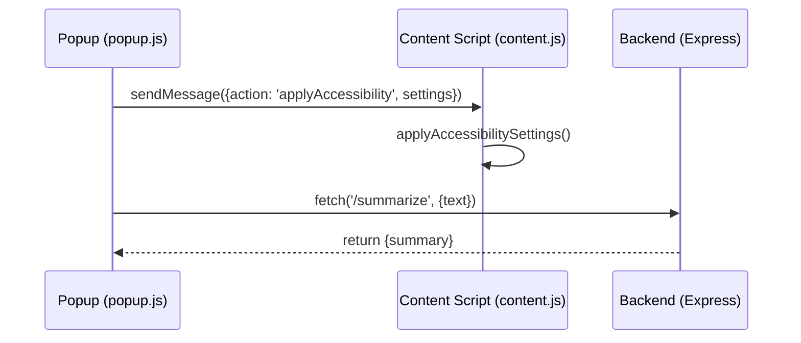

# AccessNow Extension 🧩

The AccessNow extension provides a user-friendly interface to adapt any webpage's visual and reading experience.

## 🛠 Architecture

The extension follows the standard Chrome Manifest V3 structure:

-   **`manifest.json`**: Configures permissions (`activeTab`, `scripting`, `storage`) and registers the popup and content scripts.
-   **`popup.js`**: Controls the extension's UI, business logic for summarization, text-to-speech, and settings management.
-   **`content.js`**: Injected into webpages to dynamically apply CSS overrides based on user settings.
-   **`popup.html` / `popup.css`**: The design and structure of the extension's interface.

## 🌟 Core Features

### 1. Visual Accessibility Settings
Injected via `content.js`, these settings apply `!important` CSS rules to the DOM:
-   **Themes**: High-contrast modes like Blue-Yellow, Yellow-Blue, Dark, and Grayscale.
-   **Typography**: Font size adjustment (12px to 32px), letter spacing, and line height.
-   **Dyslexia Font**: Option to enable 'OpenDyslexic' font for improved readability.

#### ♿ WCAG 2.1 Mapping (Visual)
-   **Contrast (Minimum) (1.4.3)**: High-contrast themes ensure a ratio of at least 4.5:1.
-   **Resize Text (1.4.4)**: Dynamic font size adjustment up to 32px without loss of content.
-   **Visual Presentation (1.4.8)**: Custom line height and letter spacing controls.
-   **Text Spacing (1.4.12)**: Supports user-defined overrides for improved readability.

### 2. Reading & Analysis Mode
Managed by `popup.js`:
-   **Page Extraction**: Uses `innerText` extraction from semantic HTML elements (`p`, `h1-h6`, `li`, etc.).
-   **AI Summarization**: Sends extracted text to the local Node.js backend (`/summarize` endpoint).
-   **Q&A**: Allows users to query the page content using a keyword-based matching algorithm (local fallback) or AI.

### 3. Text-To-Speech (TTS)
-   Uses the browser's `SpeechSynthesis` API.
-   Provides controls to read aloud the summary or simplified text.
-   Supports start/stop functionality.

## 📡 Messaging Flow

## ⚙️ Configuration

Settings are persisted across browser sessions using `chrome.storage.sync`. This ensures a consistent user experience when navigating between tabs or reopening the browser.
