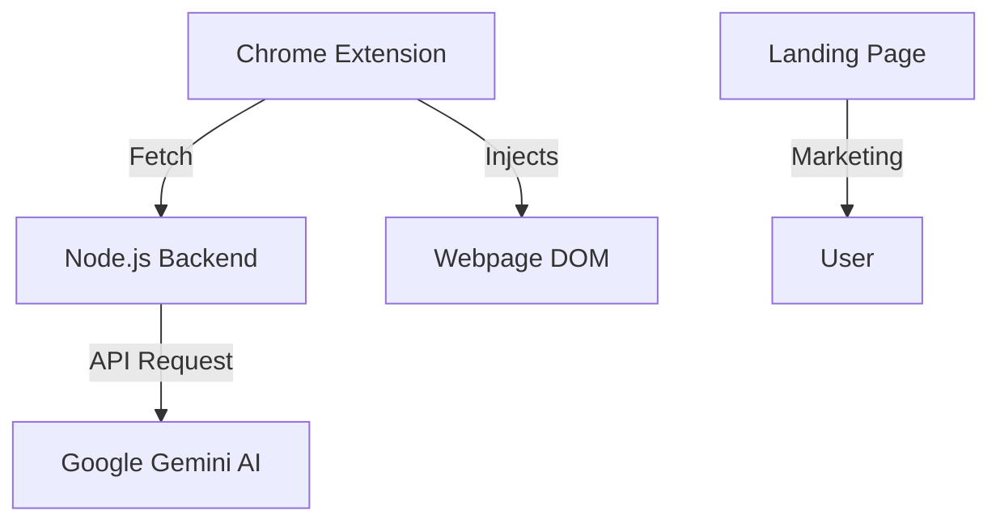

# AccessNow 🌐

AccessNow is an all-in-one accessibility layer for the web. It is a Chrome Extension designed to support low-vision, dyslexic, and heavy readers by providing summarization, simplification, text-to-speech, and visual adaptivity.

## 🚀 Key Features

-   **📊 AI Summarization**: Condense long articles into 5 short bullet points using Google Gemini.
-   **🔊 Text-to-Speech**: Read summaries and page content aloud using the Web Speech API.
-   **🎨 Visual Accessibility**: Apply high-contrast themes, dark mode, and dyslexia-friendly fonts.
-   **📏 Custom Layouts**: Adjust font size, line height, and letter spacing on any webpage.
-   **🧠 Q&A**: Ask questions about the page content and get AI-powered answers.

## ♿ WCAG 2.1 Compliance

AccessNow is developed with a commitment to the **Web Content Accessibility Guidelines (WCAG) 2.1** standard. Our features map directly to the four core principles of accessibility:

-   **Perceivable**: Adaptive themes and Text-to-Speech (TTS) ensure content is perceivable for users with visual impairments.
-   **Operable**: Simplification of page structural elements improves operability for users with diverse navigation needs.
-   **Understandable**: AI-driven summarization and simplification make the content more understandable by reducing cognitive load.
-   **Robust**: The browser-level "layer" implementation ensures robust compatibility across legacy and modern web platforms.

## 🏗 Project Structure

-   **`/`**: Chrome Extension source code (`manifest.json`, `popup.js`, `content.js`).
-   **`/accessnow-backend`**: Node.js Express server handling Gemini AI integrations.
-   **`/website`**: Modern landing page for the project.

## 🛠 Tech Stack

-   **Frontend**: HTML, CSS, JavaScript (Vanilla).
-   **Extension APIs**: Chrome Scripting, Storage, and Messaging.
-   **Backend**: Node.js, Express, `node-fetch`, Google Gemini API.
-   **Voice**: Web Speech API (SpeechSynthesis).

## 📥 Installation

### Extension
1.  Clone this repository.
2.  Open Chrome and navigate to `chrome://extensions`.
3.  Enable **Developer Mode** (top right).
4.  Click **Load unpacked** and select the root directory of this project.

### Backend
1.  Navigate to `accessnow-backend/`.
2.  Install dependencies: `npm install`.
3.  Create a `.env` file with your `GEMINI_API_KEY`.
4.  Start the server: `npm start`.

## 📖 Detailed Documentation

-   [Extension Guide](EXTENSION.md)
-   [Backend Specification](BACKEND.md)
-   [Website Overview](WEBSITE.md)

---
*Built as an accessibility-focused prototype.*